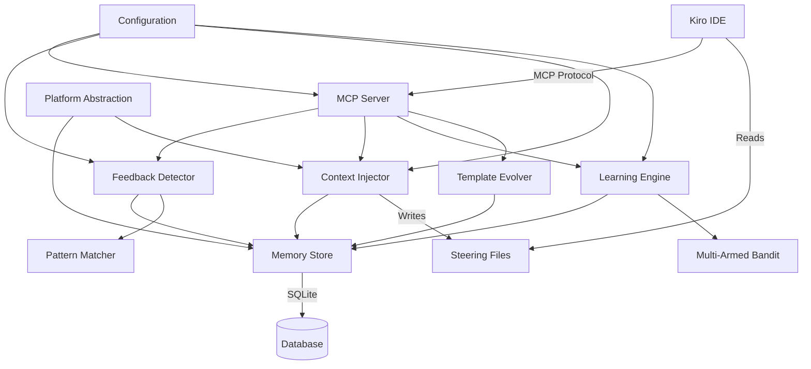

# Design Document: Claudarity Modernization for Kiro

## Overview

Claudarity is being modernized from a bash-hook-based system for Claude Code CLI to a cross-platform, Kiro-native system using steering files and MCP servers. The core challenge is maintaining the reinforcement learning capabilities while adapting to Kiro's architecture.

### Key Design Principles

1. **Cross-Platform First**: Abstract all platform-specific operations behind interfaces
2. **Kiro Native**: Use steering files instead of bash hooks for context injection
3. **Privacy Preserved**: All data remains local, no external transmission
4. **Learning Continuity**: Maintain multi-armed bandit reinforcement learning
5. **Minimal Intrusion**: Complement rather than duplicate Kiro's native features

### Architecture Philosophy

The system follows a layered architecture:
- **Interface Layer**: MCP server for Kiro integration
- **Application Layer**: Core learning and feedback detection logic
- **Platform Layer**: Cross-platform abstractions for file system, shell, and paths
- **Data Layer**: SQLite database with migration support

## Architecture

### System Components



### Component Responsibilities

**MCP Server**
- Exposes Claudarity functionality to Kiro via Model Context Protocol
- Handles tool invocations for memory queries, feedback review, template inspection
- Manages session lifecycle and coordinates component interactions
- Provides health checks and diagnostics

**Feedback Detector**
- Analyzes conversation text to identify positive/negative feedback
- Uses pattern matching with confidence scoring
- Achieves >90% F1 score through trained pattern library
- Extracts context (code snippets, file paths, suggestion types) from feedback

**Context Injector**
- Queries Memory Store for relevant historical context
- Ranks context by recency, confidence, and semantic similarity
- Generates steering files in .kiro/steering/ with structured Markdown
- Manages steering file lifecycle (creation, updates, cleanup)
- Enforces token limits (max 2000 tokens per file, max 3 active files)

**Learning Engine**
- Implements multi-armed bandit algorithm for pattern selection
- Maintains confidence scores using Bayesian updating
- Balances exploration vs exploitation based on confidence levels
- Tracks success rates per pattern type and context
- Provides confidence intervals for metrics

**Template Evolver**
- Maintains library of code pattern templates with confidence scores
- Updates template weights based on feedback
- Supports pattern categories (error handling, naming, structure, testing)
- Archives low-confidence templates
- Tracks evolution history for analysis

**Memory Store**
- SQLite database interface with schema management
- Supports feedback_log, context_memory, code_preferences, session_log, template_evolution, terminal_activity tables
- Handles database migrations for schema updates
- Provides export/import functionality
- Implements platform-agnostic path storage

**Platform Abstraction**
- Detects operating system and configures platform-specific components
- Provides unified interface for file operations, path handling, shell execution
- Handles Windows (PowerShell), macOS (bash/zsh), Linux (bash/zsh)
- Manages platform-appropriate configuration locations

### Data Flow

**Feedback Learning Flow**:
1. User interacts with Kiro, provides feedback on suggestions
2. MCP Server captures conversation context
3. Feedback Detector analyzes text, identifies feedback type and context
4. Learning Engine updates confidence scores using multi-armed bandit
5. Template Evolver adjusts pattern weights
6. Memory Store persists updates

**Context Injection Flow**:
1. Session starts or context becomes relevant
2. Context Injector queries Memory Store for relevant history
3. Context ranked by relevance (recency + confidence + similarity)
4. Top contexts formatted as Markdown steering files
5. Steering files written to .kiro/steering/
6. Kiro reads steering files and incorporates context
7. Outdated steering files cleaned up

## Components and Interfaces

### MCP Server Interface

The MCP server exposes the following tools to Kiro:

```typescript
interface MCPTools {
  // Memory queries
  queryMemory(params: {
    contextType?: 'feedback' | 'preference' | 'pattern' | 'session',
    filePattern?: string,
    timeRange?: { start: Date, end: Date },
    limit?: number
  }): MemoryQueryResult[];
  
  // Feedback management
  reviewFeedback(params: {
    sessionId?: string,
    limit?: number
  }): FeedbackEntry[];
  
  correctFeedback(params: {
    feedbackId: string,
    correctedType: 'positive' | 'negative' | 'neutral'
  }): void;
  
  // Template inspection
  inspectTemplates(params: {
    category?: string,
    minConfidence?: number
  }): TemplateInfo[];
  
  // Memory management
  exportMemory(params: {
    outputPath: string,
    includeArchived?: boolean
  }): ExportResult;
  
  importMemory(params: {
    sourcePath: string,
    mergeStrategy: 'merge' | 'replace'
  }): ImportResult;
  
  // Steering file control
  refreshContext(params: {
    force?: boolean
  }): void;
  
  clearSteeringFiles(): void;
  
  // Diagnostics
  healthCheck(): HealthStatus;
  
  getConfig(): Configuration;
}
```

### Feedback Detector Interface

```typescript
interface FeedbackDetector {
  // Analyze text for feedback patterns
  detectFeedback(text: string, context: ConversationContext): FeedbackResult;
  
  // Extract context from feedback
  extractContext(text: string, feedback: FeedbackResult): FeedbackContext;
  
  // Get detection confidence
  getConfidence(result: FeedbackResult): number;
  
  // Update pattern library
  updatePatterns(newPatterns: Pattern[]): void;
}

interface FeedbackResult {
  type: 'positive' | 'negative' | 'neutral' | 'ambiguous';
  confidence: number; // 0-1
  matchedPatterns: string[];
  textSpan: { start: number, end: number };
}

interface FeedbackContext {
  codeSnippet?: string;
  suggestionType?: string;
  filePath?: string;
  language?: string;
  operation?: string;
}
```

### Pattern Matcher

The Pattern Matcher uses a hybrid approach:
- **Keyword matching**: Fast initial filtering for explicit feedback phrases
- **Contextual analysis**: Examines surrounding text for implicit feedback
- **Confidence scoring**: Combines multiple signals for final classification

```typescript
interface PatternMatcher {
  // Match patterns in text
  match(text: string): PatternMatch[];
  
  // Score pattern confidence
  scoreMatch(match: PatternMatch, context: string): number;
  
  // Add custom patterns
  addPattern(pattern: Pattern): void;
}

interface Pattern {
  id: string;
  type: 'positive' | 'negative';
  keywords: string[];
  contextRequirements?: string[];
  weight: number;
}
```

### Learning Engine Interface

```typescript
interface LearningEngine {
  // Update confidence scores based on feedback
  updateScores(feedback: FeedbackEntry): void;
  
  // Select pattern using multi-armed bandit
  selectPattern(context: SelectionContext): PatternSelection;
  
  // Get confidence score for pattern
  getConfidence(patternId: string, context: string): ConfidenceScore;
  
  // Get exploration rate
  getExplorationRate(): number;
  
  // Get success metrics
  getMetrics(patternType?: string): LearningMetrics;
}

interface ConfidenceScore {
  mean: number;
  variance: number;
  sampleSize: number;
  confidenceInterval: [number, number];
}

interface PatternSelection {
  patternId: string;
  confidence: number;
  isExploration: boolean;
}
```

### Multi-Armed Bandit Implementation

The learning engine uses Thompson Sampling for the multi-armed bandit:

```typescript
interface MultiArmedBandit {
  // Select arm (pattern) to pull
  selectArm(arms: Arm[]): ArmSelection;
  
  // Update arm statistics after feedback
  updateArm(armId: string, reward: number): void;
  
  // Get arm statistics
  getArmStats(armId: string): ArmStatistics;
}

interface Arm {
  id: string;
  alpha: number; // Beta distribution parameter (successes + 1)
  beta: number;  // Beta distribution parameter (failures + 1)
}

interface ArmStatistics {
  successRate: number;
  totalPulls: number;
  recentPerformance: number[]; // Last N outcomes
}
```

**Thompson Sampling Algorithm**:
1. For each arm (pattern), sample from Beta(alpha, beta) distribution
2. Select arm with highest sampled value
3. On positive feedback: increment alpha
4. On negative feedback: increment beta
5. Naturally balances exploration and exploitation

### Context Injector Interface

```typescript
interface ContextInjector {
  // Generate steering files for current context
  injectContext(session: Session): void;
  
  // Query relevant context from memory
  queryRelevantContext(session: Session): ContextEntry[];
  
  // Rank context by relevance
  rankContext(contexts: ContextEntry[], session: Session): RankedContext[];
  
  // Format context as steering file
  formatSteeringFile(contexts: RankedContext[]): string;
  
  // Clean up outdated steering files
  cleanupSteeringFiles(): void;
}

interface RankedContext {
  context: ContextEntry;
  relevanceScore: number;
  recencyScore: number;
  confidenceScore: number;
  combinedScore: number;
}
```

**Relevance Scoring Formula**:
```
combinedScore = (0.4 * recencyScore) + (0.3 * confidenceScore) + (0.3 * semanticSimilarity)

recencyScore = exp(-age_in_days / decay_constant)
confidenceScore = learningEngine.getConfidence(context.patternId)
semanticSimilarity = cosineSimilarity(currentContext, historicalContext)
```

### Template Evolver Interface

```typescript
interface TemplateEvolver {
  // Update template weight based on feedback
  updateTemplate(templateId: string, feedback: FeedbackEntry): void;
  
  // Get templates for category
  getTemplates(category: string, minConfidence?: number): Template[];
  
  // Archive low-confidence templates
  archiveTemplates(threshold: number): void;
  
  // Track template evolution
  getEvolutionHistory(templateId: string): EvolutionEntry[];
}

interface Template {
  id: string;
  category: 'error_handling' | 'naming' | 'structure' | 'testing';
  pattern: string;
  confidence: number;
  usageCount: number;
  lastUsed: Date;
  archived: boolean;
}
```

### Memory Store Interface

```typescript
interface MemoryStore {
  // Feedback operations
  storeFeedback(feedback: FeedbackEntry): void;
  queryFeedback(filter: FeedbackFilter): FeedbackEntry[];
  
  // Context operations
  storeContext(context: ContextEntry): void;
  queryContext(filter: ContextFilter): ContextEntry[];
  
  // Preference operations
  storePreference(pref: PreferenceEntry): void;
  queryPreferences(filter: PreferenceFilter): PreferenceEntry[];
  
  // Session operations
  createSession(session: Session): string;
  updateSession(sessionId: string, updates: Partial<Session>): void;
  querySession(filter: SessionFilter): Session[];
  
  // Template operations
  storeTemplate(template: Template): void;
  updateTemplate(templateId: string, updates: Partial<Template>): void;
  queryTemplates(filter: TemplateFilter): Template[];
  
  // Export/Import
  exportDatabase(path: string): void;
  importDatabase(path: string, strategy: 'merge' | 'replace'): void;
  
  // Migration
  getCurrentVersion(): number;
  migrate(targetVersion: number): void;
}
```

### Platform Abstraction Interface

```typescript
interface PlatformAbstraction {
  // OS detection
  getOperatingSystem(): 'windows' | 'macos' | 'linux';
  
  // Path operations
  normalizePath(path: string): string;
  joinPath(...segments: string[]): string;
  getConfigDir(): string;
  getDataDir(): string;
  
  // Shell operations
  getShellType(): 'powershell' | 'bash' | 'zsh';
  executeShellCommand(command: string): Promise<ShellResult>;
  
  // File operations
  readFile(path: string): Promise<string>;
  writeFile(path: string, content: string): Promise<void>;
  fileExists(path: string): Promise<boolean>;
  createDirectory(path: string): Promise<void>;
}
```

## Data Models

### Database Schema

```sql
-- Feedback log: stores all detected feedback with context
CREATE TABLE feedback_log (
  id TEXT PRIMARY KEY,
  session_id TEXT NOT NULL,
  timestamp INTEGER NOT NULL,
  feedback_type TEXT NOT NULL, -- 'positive', 'negative', 'neutral'
  confidence REAL NOT NULL,
  text_content TEXT,
  code_snippet TEXT,
  file_path TEXT,
  suggestion_type TEXT,
  language TEXT,
  operation TEXT,
  matched_patterns TEXT, -- JSON array
  corrected BOOLEAN DEFAULT 0,
  corrected_type TEXT,
  FOREIGN KEY (session_id) REFERENCES session_log(id)
);

-- Context memory: stores reusable context snippets
CREATE TABLE context_memory (
  id TEXT PRIMARY KEY,
  session_id TEXT NOT NULL,
  timestamp INTEGER NOT NULL,
  context_type TEXT NOT NULL, -- 'code_pattern', 'preference', 'solution'
  content TEXT NOT NULL,
  file_path TEXT,
  language TEXT,
  tags TEXT, -- JSON array
  relevance_score REAL DEFAULT 0.5,
  usage_count INTEGER DEFAULT 0,
  last_used INTEGER,
  FOREIGN KEY (session_id) REFERENCES session_log(id)
);

-- Code preferences: stores learned coding preferences
CREATE TABLE code_preferences (
  id TEXT PRIMARY KEY,
  category TEXT NOT NULL, -- 'error_handling', 'naming', 'structure', 'testing'
  preference_key TEXT NOT NULL,
  preference_value TEXT NOT NULL,
  confidence REAL NOT NULL,
  evidence_count INTEGER DEFAULT 1,
  last_updated INTEGER NOT NULL,
  UNIQUE(category, preference_key)
);

-- Session log: tracks user sessions
CREATE TABLE session_log (
  id TEXT PRIMARY KEY,
  start_time INTEGER NOT NULL,
  end_time INTEGER,
  project_path TEXT,
  activity_summary TEXT,
  feedback_count INTEGER DEFAULT 0,
  context_injections INTEGER DEFAULT 0
);

-- Template evolution: tracks code template learning
CREATE TABLE template_evolution (
  id TEXT PRIMARY KEY,
  category TEXT NOT NULL,
  pattern TEXT NOT NULL,
  confidence REAL NOT NULL,
  alpha REAL NOT NULL, -- Beta distribution parameter
  beta REAL NOT NULL,  -- Beta distribution parameter
  usage_count INTEGER DEFAULT 0,
  last_used INTEGER,
  archived BOOLEAN DEFAULT 0,
  created_at INTEGER NOT NULL,
  updated_at INTEGER NOT NULL
);

-- Template history: tracks template evolution over time
CREATE TABLE template_history (
  id TEXT PRIMARY KEY,
  template_id TEXT NOT NULL,
  timestamp INTEGER NOT NULL,
  confidence_before REAL NOT NULL,
  confidence_after REAL NOT NULL,
  feedback_type TEXT NOT NULL,
  FOREIGN KEY (template_id) REFERENCES template_evolution(id)
);

-- Terminal activity: stores terminal command patterns (optional)
CREATE TABLE terminal_activity (
  id TEXT PRIMARY KEY,
  session_id TEXT NOT NULL,
  timestamp INTEGER NOT NULL,
  command TEXT NOT NULL,
  exit_code INTEGER,
  duration_ms INTEGER,
  FOREIGN KEY (session_id) REFERENCES session_log(id)
);

-- Schema version tracking
CREATE TABLE schema_version (
  version INTEGER PRIMARY KEY,
  applied_at INTEGER NOT NULL
);
```

### Migration Strategy

**Version 1 → Version 2 (Example)**:
```sql
-- Add new column to feedback_log
ALTER TABLE feedback_log ADD COLUMN corrected BOOLEAN DEFAULT 0;
ALTER TABLE feedback_log ADD COLUMN corrected_type TEXT;

-- Update schema version
INSERT INTO schema_version (version, applied_at) VALUES (2, strftime('%s', 'now'));
```

**Migration Process**:
1. Check current schema version
2. Apply migrations sequentially from current to target version
3. Wrap each migration in a transaction
4. Validate data integrity after migration
5. Create backup before migration
6. Log migration results

### Configuration Schema

```yaml
# .kiro/claudarity/config.yaml

# Learning parameters
learning:
  exploration_rate: 0.1  # 10% exploration, 90% exploitation
  confidence_threshold: 0.7  # Minimum confidence for high-confidence actions
  decay_constant: 7.0  # Days for recency decay (exp(-age/decay))
  min_samples: 5  # Minimum samples before high confidence

# Context injection
context:
  max_steering_files: 3  # Maximum active steering files
  max_tokens_per_file: 2000  # Token limit per steering file
  cleanup_age_days: 7  # Remove steering files older than this
  relevance_weights:
    recency: 0.4
    confidence: 0.3
    similarity: 0.3

# Feedback detection
feedback:
  min_confidence: 0.6  # Minimum confidence to record feedback
  ambiguity_threshold: 0.5  # Below this, feedback is ambiguous
  pattern_update_frequency: 100  # Update patterns every N feedbacks

# Template evolution
templates:
  archive_threshold: 0.3  # Archive templates below this confidence
  min_usage_for_confidence: 3  # Minimum uses before trusting confidence
  categories:
    - error_handling
    - naming
    - structure
    - testing

# Storage
storage:
  database_path: "${KIRO_DATA_DIR}/claudarity/memory.db"
  backup_frequency_days: 7
  max_backups: 5

# Features
features:
  template_evolution: true
  context_injection: true
  feedback_detection: true
  terminal_tracking: false

# Logging
logging:
  level: "INFO"  # DEBUG, INFO, WARN, ERROR
  file: "${KIRO_DATA_DIR}/claudarity/claudarity.log"
  max_size_mb: 10
  max_files: 3
```

### Steering File Format

**Preferences Steering File** (.kiro/steering/claudarity-preferences.md):
```markdown
# Claudarity: Code Preferences

Based on your feedback history, here are your coding preferences:

## Error Handling
- Prefer explicit error types over generic exceptions (confidence: 0.85)
- Use early returns for error conditions (confidence: 0.78)

## Naming Conventions
- Use camelCase for variables and functions (confidence: 0.92)
- Prefix private methods with underscore (confidence: 0.71)

## Testing
- Prefer property-based tests for algorithms (confidence: 0.88)
- Include edge cases in unit tests (confidence: 0.95)

---
*Generated by Claudarity | Last updated: 2024-01-15 14:30*
```

**Recent Context Steering File** (.kiro/steering/claudarity-recent-context.md):
```markdown
# Claudarity: Recent Context

## Recent Patterns

### Database Operations
You recently worked on database migration logic. Key patterns:
- Use transactions for multi-step migrations
- Validate schema after each migration step
- Create backups before destructive operations

### Error Handling
Recent feedback shows preference for:
- Structured error types with context
- Logging errors with stack traces
- Graceful degradation over crashes

---
*Generated by Claudarity | Session: abc123 | Last updated: 2024-01-15 14:30*
```


## Correctness Properties

*A property is a characteristic or behavior that should hold true across all valid executions of a system—essentially, a formal statement about what the system should do. Properties serve as the bridge between human-readable specifications and machine-verifiable correctness guarantees.*

### Property Reflection

After analyzing all acceptance criteria, I identified several areas where properties can be consolidated:

**Consolidation Decisions**:
1. **Platform-specific shell selection** (1.2, 1.3): These are specific examples, not general properties. Keep as examples.
2. **Feedback detection** (3.1, 3.2): Both test pattern detection but for different types. Combine into one property about feedback classification.
3. **Template weight updates** (5.1, 5.2): Both test weight updates but in opposite directions. Combine into one property about weight adjustment based on feedback.
4. **Context ranking** (2.7, 6.2): Both test ranking by similar criteria. These are the same property stated differently. Keep one.
5. **Steering file format** (2.2, 6.3): Both test Markdown formatting. Combine into one property.
6. **MCP tool availability** (13.2-13.6): All test that specific tools exist. Combine into one property about complete tool exposure.
7. **Configuration options** (14.2-14.4): All test that specific config options exist. Combine into one property about configuration completeness.
8. **Session tracking fields** (15.2): This can be combined with session creation (15.1) into one property about complete session lifecycle.

### Cross-Platform Properties

**Property 1: Platform Detection and Configuration**
*For any* operating system (Windows, macOS, Linux), when Claudarity initializes, it should detect the OS and configure the appropriate platform-specific components (PowerShell for Windows, bash/zsh for Unix).
**Validates: Requirements 1.1, 1.2, 1.3**

**Property 2: Path Portability**
*For any* file path stored in the Memory_Store, it should use relative paths or environment variables (no hardcoded absolute paths) and normalize path separators for the current platform.
**Validates: Requirements 1.4, 1.5**

**Property 3: Platform-Appropriate Configuration Locations**
*For any* platform, configuration files should be stored in the platform-appropriate location (AppData on Windows, ~/.config on Unix).
**Validates: Requirements 1.6**

### Steering File Properties

**Property 4: Steering File Creation from Context**
*For any* relevant context identified by the Context_Injector, a steering file should be created or updated in .kiro/steering/.
**Validates: Requirements 2.1**

**Property 5: Valid Markdown Format**
*For any* generated steering file, the content should be valid Markdown that can be parsed without errors.
**Validates: Requirements 2.2, 6.3**

**Property 6: Context Organization by Type**
*For any* set of steering files, they should be organized by context type (preferences, patterns, recent-context) with distinct filenames.
**Validates: Requirements 2.4**

**Property 7: Steering File Cleanup**
*For any* steering file older than the configured cleanup age, it should be removed or archived when cleanup runs.
**Validates: Requirements 2.5**

**Property 8: Token Limit Enforcement**
*For any* generated steering file, the token count should not exceed the configured maximum (default 2000 tokens).
**Validates: Requirements 2.6**

**Property 9: Context Prioritization**
*For any* set of relevant contexts, they should be ranked by a combination of confidence score, recency, and semantic similarity, with higher-scoring contexts prioritized.
**Validates: Requirements 2.7, 6.2**

**Property 10: Active Steering File Limit**
*For any* context injection operation, the number of active steering files should not exceed the configured maximum (default 3).
**Validates: Requirements 6.6**

**Property 11: No Empty Steering Files**
*For any* context query that returns no relevant results, no steering files should be created.
**Validates: Requirements 6.7**

### Feedback Detection Properties

**Property 12: Feedback Classification**
*For any* conversation text containing feedback patterns (positive or negative), the Feedback_Detector should correctly classify the feedback type with confidence score.
**Validates: Requirements 3.1, 3.2**

**Property 13: Context Extraction from Feedback**
*For any* detected feedback, the system should extract available context (code snippet, suggestion type, file path, language, operation).
**Validates: Requirements 3.4**

**Property 14: Confidence Score Persistence**
*For any* confidence score update in the Learning_Engine, the new score should be persisted to the Memory_Store.
**Validates: Requirements 3.6**

### Learning Engine Properties

**Property 15: Multi-Armed Bandit Score Updates**
*For any* feedback received, the Learning_Engine should update the corresponding pattern's alpha (for positive) or beta (for negative) parameter according to Bayesian updating rules.
**Validates: Requirements 3.5, 8.4**

**Property 16: Exploration-Exploitation Balance**
*For any* pattern selection, the Learning_Engine should select based on Thompson Sampling (sample from Beta distribution), naturally balancing exploration and exploitation.
**Validates: Requirements 8.2**

**Property 17: Confidence Score Maintenance**
*For any* pattern category, the Learning_Engine should maintain confidence scores with mean, variance, sample size, and confidence intervals.
**Validates: Requirements 8.3, 8.6**

**Property 18: Success Rate Tracking**
*For any* pattern type and context combination, the Learning_Engine should track success rates and recent performance history.
**Validates: Requirements 8.5**

**Property 19: Adaptive Exploration**
*For any* pattern with confidence below the configured threshold, the effective exploration rate should increase (through Thompson Sampling's natural uncertainty handling).
**Validates: Requirements 8.7**

### Template Evolution Properties

**Property 20: Template Weight Adjustment**
*For any* code pattern receiving feedback, the Template_Evolver should increase the pattern's alpha parameter for positive feedback or increase beta parameter for negative feedback.
**Validates: Requirements 5.1, 5.2**

**Property 21: Template Confidence Maintenance**
*For any* template in the library, it should have an associated confidence score derived from its alpha and beta parameters.
**Validates: Requirements 5.3**

**Property 22: Template Prioritization**
*For any* set of templates in a category, suggestions should be ordered by confidence score (alpha / (alpha + beta)) in descending order.
**Validates: Requirements 5.4**

**Property 23: Template Archiving**
*For any* template with confidence score below the configured archive threshold, it should be marked as archived and excluded from active suggestions.
**Validates: Requirements 5.6**

**Property 24: Template Evolution History**
*For any* template weight update, an entry should be added to the template_history table recording the before/after confidence and feedback type.
**Validates: Requirements 5.7**

### Memory Store Properties

**Property 25: Database Initialization**
*For any* non-existent database file at the configured path, the Memory_Store should create it with the complete schema (all required tables and indexes).
**Validates: Requirements 4.3**

**Property 26: Configurable Database Location**
*For any* configured database path in the configuration file, the Memory_Store should use that path for all database operations.
**Validates: Requirements 4.2**

**Property 27: Export Creates Valid Backup**
*For any* export operation, the resulting file should be a valid SQLite database containing all data from the source database.
**Validates: Requirements 4.4**

**Property 28: Import Merges or Replaces**
*For any* import operation with merge strategy, existing data should be preserved and new data added; with replace strategy, existing data should be cleared first.
**Validates: Requirements 4.5**

**Property 29: Schema Compatibility Validation**
*For any* import operation, the source database schema version should be validated for compatibility before importing data.
**Validates: Requirements 4.6**

**Property 30: Database Migration**
*For any* database with schema version less than the target version, migrations should be applied sequentially until the target version is reached.
**Validates: Requirements 4.7**

### Context Injection Properties

**Property 31: Session Start Context Query**
*For any* new session start, the Context_Injector should query the Memory_Store for relevant historical context.
**Validates: Requirements 6.1**

**Property 32: Context Content Inclusion**
*For any* injected context, it should include at least one of: code preferences, recent patterns, or related past solutions.
**Validates: Requirements 6.4**

**Property 33: Context Usage Tracking**
*For any* context injected into a steering file, the system should record which context was used (for feedback correlation).
**Validates: Requirements 6.5**

### Integration Properties

**Property 34: Kiro Memory Deduplication**
*For any* context that exists in Kiro's native memory (CLAUDE.md or /memory), the system should not duplicate it in Claudarity steering files.
**Validates: Requirements 7.3**

**Property 35: User Preference Priority**
*For any* conflict between Kiro memory and Claudarity memory, the system should defer to explicit user preferences (if configured).
**Validates: Requirements 7.6**

### Privacy Properties

**Property 36: Local-Only Storage**
*For any* data generated or collected by Claudarity, it should be stored in the local Memory_Store database (no external transmission).
**Validates: Requirements 9.1**

**Property 37: No External Network Calls**
*For any* operation performed by Claudarity, no network requests should be made to external services.
**Validates: Requirements 9.2**

**Property 38: Sensitive Data Exclusion**
*For any* steering file content, it should not contain sensitive data patterns (API keys, credentials, PII) - such data should be redacted or excluded.
**Validates: Requirements 9.3, 9.4**

**Property 39: Secure Data Deletion**
*For any* deletion request, all associated data should be removed from the database and not recoverable through normal queries.
**Validates: Requirements 9.6**

**Property 40: Optional Encryption**
*For any* sensitive field in the database, if encryption is enabled, the field should be encrypted using the user-provided key before storage.
**Validates: Requirements 9.7**

### Migration Properties

**Property 41: Legacy Database Reading**
*For any* legacy Claudarity SQLite database, the migration tool should successfully read and parse the database structure.
**Validates: Requirements 11.1**

**Property 42: Configuration Conversion**
*For any* bash hook configuration in the legacy system, it should be converted to an equivalent steering file configuration.
**Validates: Requirements 11.2**

**Property 43: Path Format Conversion**
*For any* hardcoded absolute path in the legacy database, it should be converted to a portable format using relative paths or environment variables.
**Validates: Requirements 11.3**

**Property 44: Migration Error Handling**
*For any* incompatible or invalid data encountered during migration, the system should log a warning and skip the entry without failing the entire migration.
**Validates: Requirements 11.4**

**Property 45: Migration Data Integrity**
*For any* migrated data, the system should validate that required fields are present and foreign key relationships are maintained.
**Validates: Requirements 11.5**

**Property 46: Migration Report Generation**
*For any* migration operation, a report should be generated showing counts of migrated items, skipped items, and any errors encountered.
**Validates: Requirements 11.6**

**Property 47: Migration Preserves Learning Data**
*For any* feedback history and confidence scores in the legacy database, they should be preserved with equivalent values in the new database after migration.
**Validates: Requirements 11.7**

### Error Handling Properties

**Property 48: Error Logging with Context**
*For any* error that occurs, a log entry should be created with the error message, stack trace, and relevant context (component, operation, parameters).
**Validates: Requirements 12.1**

**Property 49: Configurable Log Location**
*For any* configured log file path, all log entries should be written to that location.
**Validates: Requirements 12.3**

**Property 50: Background Failure Notification**
*For any* background processing failure, a notification should be sent to the user through Kiro's notification system.
**Validates: Requirements 12.4**

**Property 51: Database Failure Recovery**
*For any* database operation failure, the system should attempt recovery (retry with backoff) and log the issue before propagating the error.
**Validates: Requirements 12.7**

### MCP Server Properties

**Property 52: Complete Tool Exposure**
*For any* MCP server instance, it should expose all required tools: queryMemory, reviewFeedback, correctFeedback, inspectTemplates, exportMemory, importMemory, refreshContext, clearSteeringFiles, healthCheck, getConfig.
**Validates: Requirements 13.2, 13.3, 13.4, 13.5, 13.6**

**Property 53: Structured MCP Responses**
*For any* MCP tool invocation, the response should be a structured object compatible with Kiro's MCP protocol (valid JSON with expected schema).
**Validates: Requirements 13.7**

### Configuration Properties

**Property 54: Configuration File Reading**
*For any* valid YAML or JSON configuration file at .kiro/claudarity/config, the system should successfully parse and load the configuration.
**Validates: Requirements 14.1**

**Property 55: Complete Configuration Support**
*For any* configuration instance, it should support all required options: learning parameters (learning_rate, exploration_rate, confidence_threshold), context parameters (max_steering_files, max_tokens_per_file), and feature toggles (template_evolution, context_injection, feedback_detection).
**Validates: Requirements 14.2, 14.3, 14.4**

**Property 56: Invalid Configuration Handling**
*For any* invalid configuration value, the system should use the safe default value for that option and log a warning.
**Validates: Requirements 14.5**

**Property 57: Configuration Validation on Startup**
*For any* system startup, the configuration should be validated and any errors should be reported clearly before proceeding.
**Validates: Requirements 14.7**

### Session Management Properties

**Property 58: Session Creation on Start**
*For any* Kiro start event, a new session record should be created in the session_log table with a unique ID and start timestamp.
**Validates: Requirements 15.1**

**Property 59: Complete Session Tracking**
*For any* session, the system should track start_time, end_time (when session ends), project_path, activity_summary, feedback_count, and context_injections.
**Validates: Requirements 15.2**

**Property 60: Session Data Persistence**
*For any* session end event, the session data should be persisted to the Memory_Store with all tracked fields.
**Validates: Requirements 15.3**

**Property 61: Feedback-Session Association**
*For any* feedback or context entry, it should be associated with the current session ID via foreign key relationship.
**Validates: Requirements 15.4**

**Property 62: Session Boundary Consideration**
*For any* context relevance query, the system should consider session boundaries (prefer context from recent sessions over old sessions).
**Validates: Requirements 15.6**

**Property 63: Manual Session Boundaries**
*For any* manual session boundary command, the current session should be ended and a new session should be created.
**Validates: Requirements 15.7**

## Error Handling

### Error Categories

**1. Platform Errors**
- OS detection failure → Log error, default to Unix-like behavior
- Shell execution failure → Log error, return error result to caller
- Path normalization failure → Log warning, use path as-is

**2. Database Errors**
- Database file locked → Retry with exponential backoff (max 3 attempts)
- Schema migration failure → Rollback transaction, log error, exit with error code
- Query failure → Log error, return empty result or error to caller
- Corruption detected → Attempt recovery from backup, notify user

**3. Feedback Detection Errors**
- Pattern matching failure → Log warning, return neutral classification
- Context extraction failure → Log warning, store feedback without context
- Low confidence detection → Mark as ambiguous, use lower weight in learning

**4. Learning Engine Errors**
- Invalid confidence score → Log error, use default confidence (0.5)
- Division by zero in calculations → Log error, use safe default
- Negative alpha/beta values → Log error, reset to (1, 1)

**5. Context Injection Errors**
- Steering file write failure → Log error, retry once, notify user if still fails
- Token limit exceeded → Truncate content, log warning
- Markdown formatting error → Log warning, write as plain text

**6. MCP Server Errors**
- Tool invocation failure → Return structured error response to Kiro
- Invalid parameters → Return validation error with details
- Timeout → Return timeout error, log warning

**7. Configuration Errors**
- Config file not found → Use defaults, log info
- Invalid YAML/JSON → Use defaults, log error with parse details
- Invalid value type → Use default for that option, log warning
- Missing required field → Use default, log warning

### Error Recovery Strategies

**Graceful Degradation**:
- If feedback detection fails → Continue without learning updates
- If context injection fails → Continue without steering files
- If template evolution fails → Continue with static templates

**Retry Logic**:
- Database operations: 3 retries with exponential backoff (100ms, 200ms, 400ms)
- File operations: 2 retries with 50ms delay
- Network operations: None (should never occur)

**Fallback Behavior**:
- Missing configuration → Use safe defaults
- Corrupted database → Attempt recovery, create new if recovery fails
- Invalid feedback → Store as neutral with low confidence

**User Notification**:
- Critical errors (database corruption, migration failure) → Notify through Kiro immediately
- Warnings (low confidence, missing config) → Log only, don't interrupt
- Info (using defaults, skipping optional features) → Log at INFO level

### Logging Strategy

**Log Levels**:
- **DEBUG**: Detailed execution flow, variable values, algorithm decisions
- **INFO**: Normal operations, session start/end, configuration loaded
- **WARN**: Recoverable errors, fallback behavior, low confidence detections
- **ERROR**: Unrecoverable errors, data corruption, critical failures

**Log Format**:
```
[TIMESTAMP] [LEVEL] [COMPONENT] [OPERATION] message
  context: {key: value, ...}
  stack_trace: (if error)
```

**Log Rotation**:
- Max file size: 10MB (configurable)
- Max files: 3 (configurable)
- Rotation strategy: When size exceeded, rename to .1, .2, .3 and create new

## Testing Strategy

### Dual Testing Approach

The system requires both unit tests and property-based tests for comprehensive coverage:

**Unit Tests**: Validate specific examples, edge cases, and error conditions
- Specific feedback patterns (e.g., "looks good", "that's wrong")
- Edge cases (empty input, null values, boundary conditions)
- Error conditions (database locked, file not found)
- Integration points (MCP server endpoints, database queries)

**Property-Based Tests**: Validate universal properties across all inputs
- Feedback classification correctness across random text
- Learning algorithm convergence properties
- Database migration preserves data integrity
- Path normalization works for all path formats
- Configuration validation handles all invalid inputs

### Property-Based Testing Configuration

**Library Selection**:
- **TypeScript/JavaScript**: fast-check
- **Python**: Hypothesis
- **Rust**: proptest

**Test Configuration**:
- Minimum 100 iterations per property test (due to randomization)
- Each property test must reference its design document property
- Tag format: `Feature: claudarity-modernization, Property {number}: {property_text}`

**Example Property Test Structure**:
```typescript
import fc from 'fast-check';

// Feature: claudarity-modernization, Property 12: Feedback Classification
test('feedback detector classifies all feedback patterns correctly', () => {
  fc.assert(
    fc.property(
      fc.record({
        text: fc.string(),
        hasPositivePattern: fc.boolean(),
        hasNegativePattern: fc.boolean()
      }),
      (input) => {
        const result = feedbackDetector.detectFeedback(input.text, {});
        
        if (input.hasPositivePattern) {
          expect(result.type).toBe('positive');
        } else if (input.hasNegativePattern) {
          expect(result.type).toBe('negative');
        }
        
        expect(result.confidence).toBeGreaterThanOrEqual(0);
        expect(result.confidence).toBeLessThanOrEqual(1);
      }
    ),
    { numRuns: 100 }
  );
});
```

### Testing Coverage by Component

**Feedback Detector**:
- Unit tests: Specific feedback phrases, ambiguous cases, edge cases
- Property tests: Classification correctness (Property 12), context extraction (Property 13)
- Target: >90% F1 score on labeled test dataset

**Learning Engine**:
- Unit tests: Specific feedback sequences, boundary conditions
- Property tests: Score updates (Property 15), exploration-exploitation (Property 16), convergence
- Target: Confidence scores converge to true success rates

**Template Evolver**:
- Unit tests: Specific template updates, archiving logic
- Property tests: Weight adjustment (Property 20), prioritization (Property 22)
- Target: Templates with higher success rates have higher confidence

**Context Injector**:
- Unit tests: Specific context scenarios, token counting
- Property tests: Ranking (Property 9), token limits (Property 8), file limits (Property 10)
- Target: Context relevance correlates with user satisfaction

**Memory Store**:
- Unit tests: CRUD operations, schema validation
- Property tests: Migration (Property 30, 47), export/import (Property 27, 28)
- Target: No data loss during migrations or export/import

**Platform Abstraction**:
- Unit tests: Specific OS configurations, path examples
- Property tests: Path normalization (Property 2), platform detection (Property 1)
- Target: Works correctly on Windows, macOS, Linux

**MCP Server**:
- Unit tests: Specific tool invocations, error responses
- Property tests: Tool availability (Property 52), response format (Property 53)
- Target: All tools work correctly with valid and invalid inputs

### Cross-Platform Testing

**Test Matrix**:
- Windows 10/11 with PowerShell 5.1 and 7+
- macOS 12+ with bash and zsh
- Ubuntu 20.04+ with bash

**Platform-Specific Tests**:
- Path normalization (backslash vs forward slash)
- Configuration directory location
- Shell command execution
- File permissions and access

### Performance Testing

**Benchmarks**:
- Feedback detection: <50ms for typical conversation text (500 words)
- Context query: <100ms for typical database (10k entries)
- Steering file generation: <200ms for 3 files
- Database migration: <5s for typical database (100k entries)

**Load Testing**:
- 1000 feedback entries per session
- 100 concurrent context queries
- 10k templates in evolution library

### Regression Testing

**Feedback Detection Accuracy**:
- Maintain labeled test dataset (500+ examples)
- Run classification on full dataset
- Target: >90% F1 score
- Alert if F1 score drops below 85%

**Learning Algorithm Correctness**:
- Verify Thompson Sampling selects optimal arm in simple scenarios
- Verify confidence intervals contain true success rates
- Verify exploration rate increases with uncertainty

### Integration Testing

**End-to-End Scenarios**:
1. Fresh install → Configuration → First feedback → Context injection
2. Migration from legacy → Verify data preserved → Continue learning
3. Export → Import on new machine → Verify learning continues
4. Multiple sessions → Context recall → Verify relevance ranking
5. Error scenarios → Recovery → Verify graceful degradation

**MCP Integration**:
- Test all MCP tools through Kiro
- Verify responses are correctly formatted
- Test error handling through MCP protocol

### Test Data Management

**Fixtures**:
- Sample feedback text (positive, negative, ambiguous)
- Sample code snippets (various languages)
- Sample database states (empty, small, large, corrupted)
- Sample configuration files (valid, invalid, missing fields)

**Generators**:
- Random feedback text with known classification
- Random code patterns with known categories
- Random session data with known relationships
- Random configuration values within valid ranges

### Continuous Testing

**Pre-commit**:
- Run unit tests
- Run linting and type checking
- Run fast property tests (10 iterations)

**CI Pipeline**:
- Run all unit tests
- Run all property tests (100 iterations)
- Run cross-platform tests
- Run regression tests
- Generate coverage report (target: >80%)

**Nightly**:
- Run extended property tests (1000 iterations)
- Run performance benchmarks
- Run load tests
- Check for memory leaks
